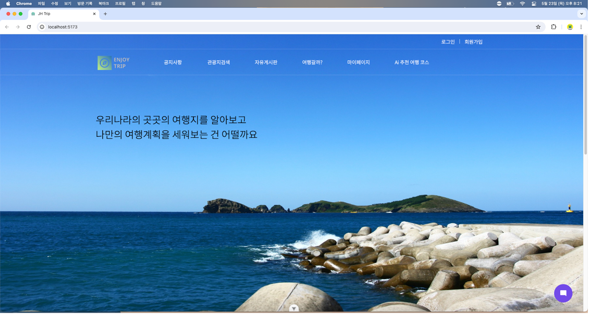

# JH Trip (Trip 웹 서비스)

  

## 프로젝트 개요

- **프로젝트 기간:** 2023.05 ~ 2023.05 (2주)
- **프로젝트 설명:**
  - 여행 계획을 세우고 서로의 여행경로를 공유하는 웹 사이트로, 사용자들이 여행 일정을 작성하고 공유할 수 있습니다.
  - 사이트는 REST API를 이용해 프론트엔드는 Vue.js, 백엔드는 Spring Boot 기반으로 개발되었습니다.
 
## 팀원

- 최재용: (https://github.com/wodyddldl333)
- 김하휼: (https://github.com/busangangster)

## 기술 스택 및 개발 환경

- **프론트엔드:** Vue.js
- **백엔드:** Spring Boot
- **데이터베이스:** MySQL
- **ORM:** Mybatis
- **AI API:** OpenAI API
- **기타:** Java

## 담당 역할

- **전체적인 UI/UX 디자인 및 프론트엔드 구현:**
  - Vue.js, TailWind, BootStrap, figma
- **Chatbot 서비스 구현:**
  - Chatgpt Api를 활용한 챗봇 기능 
- **서버와의 통신을 위한 비동기 작업 처리:**
  - axios
- **사용자 경험 개선 및 성능 최적화:**
  - lazy 기법으로 처리 

## 주요 구현 사항

- **프론트엔드:** Vue.js 이용하여 사용자 친화적 UI 디자인 및 구현
- **백엔드:** Spring Boot를 통해 CRUD 기능을 제공하는 REST API 개발
- **데이터베이스:** MySQL 데이터베이스 설계 및 Mybatis를 사용하여 데이터 매핑
- **AI 기능:** ChatGPT를 활용하여 사용자의 입력 정보를 기반으로 맞춤형 여행코스 추천

## 성과 및 학습

- **성과:**
  - 짧은 기간 내에 완성도가 높은 웹 사이트 구축
  - ChatGPT 활용한 AI 여행 코스 추천 기능을 통해 사용자 만족도 증대
- **학습:**
  - Spring Boot와 Vue.js 사용한 풀스택 개발 경험
  - 데이터베이스 연동 및 관리 기술 향상
  - 프롬프트 엔지니어링 및 AI 모델 활용한 개발 경험

## 메인 페이지

  

